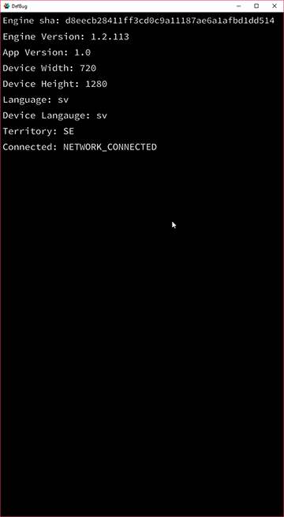
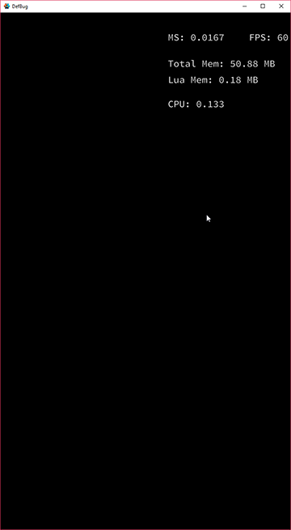

# DefBug
For adding some general debug information

 

# Installation
You can use DefBug in your own project by adding this project as a [Defold library dependency](http://www.defold.com/manuals/libraries/). Open your game.project file and in the dependencies field under project add:

	https://github.com/Jerakin/defbug/archive/master.zip
    
Once you have added the dependency to your project all you need to do is
* Add `defbug/defbug.collection` to your game 
* Load and Enable the collection in a script
* Add `defbug.on_input(action_id, action)` in your main script
* Add `debug_info` and `debug_details` in your input_bindings
